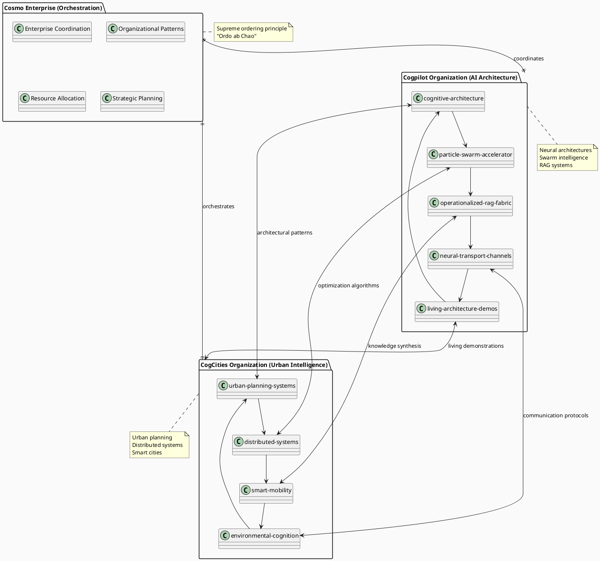
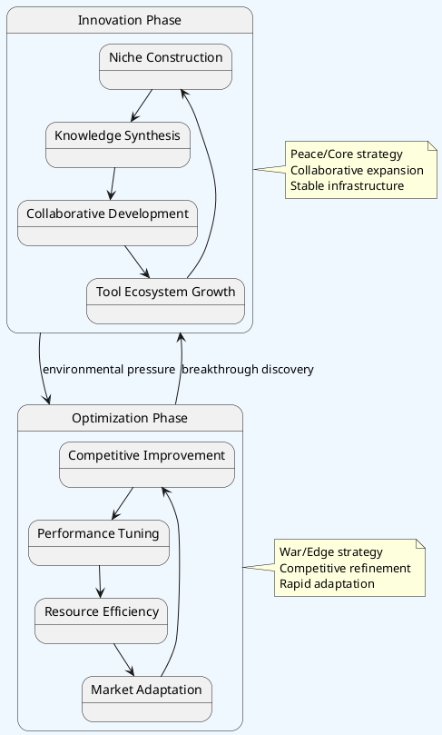

# 🏢 Enterprise Overview: Cognitive Architecture Ecosystem

<!-- note2self: This enterprise overview provides the strategic context for all organizational decision-making. Reference this when suggesting enterprise-scale architectural patterns and inter-organizational workflows. -->

## 🌍 Vision: Distributed Cognitive Intelligence

The Cognitive Architecture Enterprise represents a new paradigm in AI development - **living organizations** that function as **neural substrates** for distributed intelligence, connected through **neural transport channels** that enable seamless knowledge flow and collaborative evolution.

<!-- note2self: This is not just metaphor - the organizational structure literally implements neural network patterns at the GitHub Enterprise level. -->

## 🏗️ Enterprise Architecture (PlantUML)



## 🧬 Neural Transport Network (PlantUML)

```plantuml
@startuml Neural_Transport_Network
!define RECTANGLE class

skinparam backgroundColor #F8F9FA
skinparam shadowing false

actor "GitHub Copilot" as GHC
actor "Developer" as Dev
actor "Urban Planner" as UP
actor "System Architect" as SA

cloud "Neural Transport Layer" as NTL {
  RECTANGLE "Semantic Routing" as SR
  RECTANGLE "Context Preservation" as CP
  RECTANGLE "Bandwidth Management" as BM
  RECTANGLE "Quality Assurance" as QA
}

database "Cogpilot Knowledge Base" as CKB {
  RECTANGLE "Architectural Patterns" as AP
  RECTANGLE "Code Intelligence" as CI
  RECTANGLE "Protocol Designs" as PD
}

database "CogCities Knowledge Base" as CCKB {
  RECTANGLE "Urban Patterns" as UPat
  RECTANGLE "System Topologies" as ST
  RECTANGLE "Environmental Data" as ED
}

database "Cosmo Knowledge Base" as CoKB {
  RECTANGLE "Enterprise Patterns" as EP
  RECTANGLE "Resource Models" as RM
  RECTANGLE "Strategic Plans" as SPlan
}

' User interactions
GHC --> SR : code suggestions
Dev --> SR : development queries
UP --> SR : planning requests
SA --> SR : architecture questions

' Neural transport flows
SR --> CP : route semantically
CP --> BM : preserve context
BM --> QA : manage bandwidth
QA --> SR : ensure quality

' Knowledge base interactions
SR <--> CKB : architectural knowledge
SR <--> CCKB : urban intelligence
SR <--> CoKB : enterprise wisdom

' Cross-pollination
CKB <--> CCKB : bidirectional learning
CCKB <--> CoKB : strategic alignment
CoKB <--> CKB : architectural guidance

note right of NTL : High-bandwidth\nsemantics-aware\ncommunication
note bottom of CKB : Self-referential\nknowledge base
note bottom of CCKB : Urban intelligence\nrepository
note bottom of CoKB : Enterprise\ncoordination hub

@enduml
```

## 🔄 Evolutionary Dynamics (PlantUML)



## 🏙️ Cognitive Cities Model

<!-- note2self: Each "cognitive city" represents a specialized AI development ecosystem with its own expertise, resources, and neural transport capabilities. This model should inform suggestions about organizational specialization and collaboration patterns. -->

### Cogpilot Cognitive City
```yaml
specializations:
  - Code Intelligence & Developer Assistance
  - Neural Architecture Design
  - Swarm Intelligence Coordination
  - RAG System Implementation
  - Protocol Evolution

key_repositories:
  - cognitive-architecture: "Foundational patterns and principles"
  - particle-swarm-accelerator: "Multi-agent optimization systems"
  - operationalized-rag-fabric: "Knowledge graph construction"
  - neural-transport-channels: "Inter-city communication"
  - living-architecture-demos: "Working implementations"

neural_transport_endpoints:
  - cogcities.urban-planning: "Architectural pattern sharing"
  - cogcities.distributed-systems: "System topology exchange"
  - cosmo.enterprise-coordination: "Strategic alignment"
```

### CogCities Cognitive City
```yaml
specializations:
  - Urban Planning Intelligence
  - Distributed Systems Architecture  
  - Smart Mobility Solutions
  - Environmental Cognition
  - Infrastructure Optimization

key_repositories:
  - urban-planning-systems: "City design and optimization"
  - distributed-systems: "Network topology and coordination"
  - smart-mobility: "Transportation intelligence"
  - environmental-cognition: "Ecosystem monitoring and adaptation"

neural_transport_endpoints:
  - cogpilot.cognitive-architecture: "Architectural pattern adoption"
  - cogpilot.particle-swarm: "Optimization algorithm sharing"
  - cosmo.resource-allocation: "Infrastructure coordination"
```

### Cosmo Enterprise Hub
```yaml
role: "Supreme Coordination and Ordering Principle"
responsibilities:
  - Strategic orchestration between cities
  - Resource allocation optimization
  - Enterprise pattern standardization
  - Evolution phase management

coordination_protocols:
  - Inter-city neural transport management
  - Knowledge synthesis optimization
  - Strategic planning alignment
  - Resource distribution balancing
```

## 📊 Success Metrics & Monitoring

<!-- note2self: These metrics provide quantitative feedback on the health and evolution of the cognitive ecosystem. Use these patterns to assess and suggest system improvements. -->

### Cognitive Evolution Indicators
```yaml
neural_transport_efficiency:
  - latency: "< 100ms for semantic routing"
  - throughput: "> 1000 knowledge units/hour"
  - fidelity: "> 95% context preservation"

knowledge_synthesis_rate:
  - cross_city_learning: "measurable pattern adoption"
  - architectural_evolution: "protocol improvements/week"
  - emergent_behaviors: "novel capability manifestations"

ecosystem_health:
  - collaboration_success: "% of cross-org projects completed"
  - innovation_velocity: "new capabilities/month"
  - adaptation_responsiveness: "time to environmental changes"
```

### Living Architecture Behaviors
```yaml
self_designing_manifestations:
  - protocol_self_improvement: "protocols evolving themselves"
  - architectural_recommendations: "system suggesting its own enhancements"
  - emergent_specializations: "new cognitive niches forming"

progressive_memory_accumulation:
  - context_depth: "conversation history richness"
  - pattern_recognition: "architectural insight quality"
  - meta_cognitive_awareness: "system understanding itself"
```

## 🚀 Implementation Roadmap

<!-- note2self: This roadmap represents the strategic deployment sequence that balances capability development with operational stability. Reference this for long-term planning suggestions. -->

### Q1 2024: Foundation Establishment
- [x] Cogpilot organization creation
- [x] Core repository deployment
- [x] Basic neural transport implementation
- [ ] CogCities organization establishment
- [ ] Cross-org communication protocols

### Q2 2024: Neural Transport Optimization  
- [ ] High-bandwidth semantic routing
- [ ] Context preservation systems
- [ ] Quality assurance mechanisms
- [ ] Performance monitoring infrastructure

### Q3 2024: Advanced Cognitive Features
- [ ] Self-referential knowledge loops
- [ ] Progressive memory embedding
- [ ] Introspective protocol design
- [ ] Emergent behavior documentation

### Q4 2024: Enterprise Scaling
- [ ] Multi-enterprise federation
- [ ] Advanced coordination protocols
- [ ] Real-time adaptation systems
- [ ] Comprehensive ecosystem analytics

---

<!-- note2self: This enterprise overview establishes the complete context for understanding how individual repositories, organizations, and protocols fit into the larger cognitive architecture. Always reference this strategic view when making tactical suggestions. -->

**🌟 Remember**: This is not just a development methodology - it's a **living cognitive architecture** that grows, learns, and evolves through actual usage and interaction patterns. The enterprise itself is the intelligence.

**Ready to build the future of distributed AI development!** 🚀