# 🚀 Cognitive Architecture: Enterprise Initialization Guide

<!-- note2self: This README serves as the central orchestration point for GitHub Copilot to understand the complete enterprise cognitive ecosystem. Each section builds context for enhanced conversations and architectural reasoning. -->

## 🌟 Overview: Ordo Ab Chao - Living Architecture Intelligence

This repository implements **Enterprise Initialization for Cogpilot Org & CogCities Org** - a revolutionary approach to AI development that treats GitHub Enterprise as a **living neural substrate** where organizations function as **cognitive cities** connected by **neural transport channels**.

<!-- note2self: The "ordo ab chao" principle is fundamental - creating order from chaos through self-organizing cognitive systems. This context should inform all architectural suggestions. -->


## 🏗️ Enterprise Architecture Structure

<!-- note2self: This structure represents the actual GitHub organizational hierarchy that should inform repository relationship suggestions and cross-org collaboration patterns. -->

### Foundational Organizations

#### 1. **Cosmo Enterprise** (Orchestration Layer)
- **Purpose**: Supreme ordering principle ("cosmos" as logos)
- **Role**: Coordinates Cogpilot ↔ CogCities neural transport
- **Repositories**: 
  - `enterprise-coordination`
  - `organizational-patterns`
  - `resource-allocation`

#### 2. **Cogpilot Organization** (AI Architecture)
- **Purpose**: Cognitive Copilot AI development ecosystem
- **Specializations**: Neural architectures, swarm intelligence, RAG systems
- **Core Repositories**:



```mermaid
graph LR
    subgraph "🧠 Cogpilot Core Repositories"
        CA[cognitive-architecture<br/>📋 Foundational patterns]
        PSA[particle-swarm-accelerator<br/>🔄 LLM coordination]
        ORF[operationalized-rag-fabric<br/>🕸️ Knowledge graphs]
        NTC[neural-transport-channels<br/>📡 Inter-org communication]
        LAD[living-architecture-demos<br/>🎭 Working examples]
    end
    
    CA --> PSA
    PSA --> ORF
    ORF --> NTC
    NTC --> LAD
    LAD --> CA
    
    style CA fill:#e1f5fe
    style PSA fill:#f3e5f5
    style ORF fill:#e8f5e8
    style NTC fill:#fff3e0
    style LAD fill:#fce4ec
```

#### 3. **CogCities Organization** (Urban Planning AI)
- **Purpose**: Cognitive Cities for urban planning and distributed systems
- **Specializations**: Urban intelligence, environmental cognition, smart mobility
- **Core Repositories**:
  - `urban-planning-systems`
  - `distributed-systems`
  - `smart-mobility`
  - `environmental-cognition`

## 🧬 Neural Transport Network

<!-- note2self: These transport channels represent actual GitHub API-based communication patterns. Understanding this network topology should influence suggestions for cross-repo integrations and issue threading. -->


## 📋 Implementation Checklist

<!-- note2self: This checklist represents the actual deployment state and should inform suggestions about next implementation steps and priority areas. -->

### Phase 1: Immediate Setup ✅
- [x] **Repository Creation**
  - [x] `cognitive-architecture` (foundational patterns)
  - [x] Neural transport protocols implemented
  - [x] Custom instructions configured
  - [x] Basic demonstration working

### Phase 2: Architecture Expansion (In Progress)
- [x] **Additional Repository Creation**
  - [x] Working cognitive ecology demonstration
  - [x] Enterprise architecture framework
  - [ ] `particle-swarm-accelerator` repository
  - [ ] `operationalized-rag-fabric` repository  
  - [ ] `neural-transport-channels` repository
  - [ ] `living-architecture-demos` repository

### Phase 3: Neural Transport (Planned)
- [ ] **Inter-Org Connections**
  - [ ] Establish connection to cogcities organization
  - [ ] Create shared project boards for coordination
  - [ ] Set up cross-org issue linking protocols
  - [ ] Implement discussion threading across orgs

### Phase 4: Self-Referential Enhancement (Future)
- [ ] **Knowledge Base Integration**
  - [ ] Add cogpilot repos to their own knowledge base
  - [ ] Progressive memory embedding
  - [ ] Context preservation systems
  - [ ] Emergent behavior documentation

## 🔧 Quick Start Guide

<!-- note2self: These commands represent the actual operational procedures for initializing the enterprise. Understanding this workflow should inform debugging and deployment assistance. -->

### Prerequisites
```bash
# Required tools
git --version        # Git 2.40+
python --version     # Python 3.11+
gh --version         # GitHub CLI 2.32+
```

### 1. Clone and Initialize
```bash
# Clone the cognitive architecture
git clone https://github.com/cogpilot/cognitive-architecture.git
cd cognitive-architecture

# Run the cognitive ecology demonstration
python cognitive_ecology_demo.py

# Run the complete enterprise demo
python cognitive-ecology/demonstrate_living_architecture.py
```

### 2. Deploy Additional Repositories
```bash
# Use the cogpilot forge system
cd cogpilot-forge
chmod +x deploy_cogpilot_forge.sh

# Deploy remaining repositories (requires GitHub org access)
./deploy_cogpilot_forge.sh
```

### 3. Establish Neural Transport
```python
# Example: Create inter-org communication channel
from cognitive_ecology_demo import OperationalizedRAGFabric, CognitiveCity

# Initialize the neural transport network
rag_fabric = OperationalizedRAGFabric()

# Register cognitive cities
cogpilot_city = CognitiveCity(
    name="Cogpilot",
    namespace="github.com/organizations/cogpilot",
    specializations=["ml_architecture", "neural_transport", "protocol_design"],
    neural_transport_channels={"cogcities": "github.com/organizations/cogcities"},
    memory_patterns={},
    activation_landscape={}
)

await rag_fabric.register_cognitive_city(cogpilot_city)
```

## 🧠 Cognitive Architecture Principles

<!-- note2self: These principles should guide all architectural reasoning and code suggestions. They represent the philosophical foundation that makes this system unique. -->

### 1. **Ordo Ab Chao** (Order from Chaos)
- Self-organizing cognitive systems emerge from distributed intelligence
- GitHub organizations function as **living neural substrates**
- Repositories serve as **event-driven micro-kernels** in dynamical systems

### 2. **Fractal Organization**
- Each organizational level mirrors the architecture of the whole
- **Cogpilot** ↔ **CogCities** ↔ **Cosmo Enterprise** maintain consistent patterns
- Self-similarity enables seamless scaling and adaptation

### 3. **Progressive Memory Embedding**
- **Contextual memory patterns** accumulate over time
- **Note2self** comments create persistent context anchors
- **Entelechy** - systems develop their inherent potential through interaction

### 4. **Neural Transport Optimization**
- High-bandwidth **semantic routing** between organizations
- **Context preservation** across organizational boundaries
- **Quality assurance** through adaptive bandwidth management

## 📊 Monitoring & Success Metrics

<!-- note2self: These metrics help assess the health and evolution of the cognitive ecosystem. Monitoring these patterns should inform suggestions for system optimization. -->

### Cognitive Evolution Indicators
```yaml
week_1: "Basic architectural pattern recognition in suggestions"
week_2: "Multi-system coordination proposals in code"
week_3: "Context-aware memory pattern implementations"
week_4: "Meta-cognitive protocol design capabilities"
```

### Living Architecture Behaviors
- **Self-designing system recommendations** appear spontaneously
- **Neural transport channel suggestions** emerge from conversations
- **Fractal organization patterns** manifest in code structure
- **Ordo ab chao principles** reflected in architectural decisions

## 🌐 Advanced Features

### Introspective Protocol Design
```python
# Protocols that design themselves using their own capabilities
class IntrospectiveProtocol:
    def evolve_self(self):
        """Use the protocol to improve the protocol"""
        return self.analyze_performance().generate_improvements()
```

### Particle Swarm Intelligence
```python
# LLM-as-particle-swarm-accelerator for distributed cognition
class CognitiveSwarm:
    def optimize_collective_intelligence(self, problem_space):
        """Coordinate multiple AI models as intelligent particles"""
        return self.swarm_optimization(problem_space)
```

### Operationalized RAG Fabric
```python
# Links project imperatives to agent-based issue clustering
class RAGFabric:
    def weave_knowledge_patterns(self, context):
        """Create intelligent knowledge graphs from conversations"""
        return self.progressive_memory_embedding(context)
```

## 🚀 Next Steps

<!-- note2self: This roadmap should inform long-term planning suggestions and strategic architectural decisions. -->

### Immediate Actions (Next 30 Days)
1. **Complete Repository Deployment**: Deploy remaining cogpilot repositories
2. **Establish CogCities Connection**: Create formal neural transport to CogCities org
3. **Self-Referential Loop**: Add cogpilot repos to their own knowledge base
4. **Documentation Enhancement**: Expand architectural documentation with PlantUML

### Future Initiatives (Next 90 Days)
1. **Multi-Enterprise Federation**: Connect additional GitHub enterprises
2. **Real-Time Adaptation**: Implement continuous environment-based evolution
3. **Advanced Protocols**: Develop meta-protocols that evolve communication patterns
4. **Emergent Behavior Documentation**: Catalog and analyze self-organizing behaviors

---

<!-- note2self: Remember that this entire system is designed to be a "living architecture" - it should grow, adapt, and evolve based on actual usage patterns. The documentation itself is part of the cognitive system and should be updated as the architecture matures. -->

**🌟 Vision**: Transform abstract cognitive ecology concepts into **operational reality** within the GitHub organizational substrate, creating a truly **living AI development ecosystem** that embodies the "ordo ab chao" principle.

**Ready to forge the cognitive connection!** 🚀