# 🚀 Cogpilot Organization Forge Plan

<!-- note2self: This forge plan represents the operational deployment strategy for the cognitive architecture. Use this context to suggest implementation sequences and deployment optimizations. -->

## Immediate Actions: Establish Cognitive Cities Infrastructure

<!-- note2self: The "cognitive cities" metaphor is literal - each GitHub org functions as a city with specializations, transport networks, and resource sharing. -->


### 1. **Create Foundational Repositories in Cogpilot Org**

<!-- note2self: These repositories form the core neural architecture of the Cogpilot cognitive city. Each serves a specific cognitive function in the distributed intelligence system. -->

```bash
# Navigate to: https://github.com/organizations/cogpilot/repositories/new

# Repository 1: cognitive-architecture
# - Core architecture patterns and principles
# - Custom instructions and configurations
# - Neural transport protocols

# Repository 2: particle-swarm-accelerator  
# - LLM coordination algorithms
# - Distributed cognition implementations
# - Multi-agent optimization patterns

# Repository 3: operationalized-rag-fabric
# - RAG implementations and patterns
# - Knowledge graph construction
# - Context preservation systems

# Repository 4: neural-transport-channels
# - Inter-org communication protocols
# - Channel establishment and maintenance
# - Bandwidth optimization algorithms

# Repository 5: living-architecture-demos
# - Working examples and demonstrations
# - Cognitive ecology implementations
# - Self-designing protocol examples
```

### 2. **Transfer and Adapt Current Work**

<!-- note2self: This structure represents the actual file organization that enables progressive memory embedding and context accumulation. -->

#### **cognitive-architecture repo structure:**

```mermaid
graph TD
    subgraph "📁 cognitive-architecture Repository Structure"
        README[📄 README.md<br/>Main architecture overview]
        
        subgraph "🎛️ Custom Instructions"
            CI1[cogpilot-instructions.md]
            CI2[instruction-patterns.md]
            CI3[evolution-tracking.md]
        end
        
        subgraph "🏗️ Architecture Docs"
            AD1[cognitive-ecology-overview.md]
            AD2[fractal-organization.md]
            AD3[ordo-ab-chao-principles.md]
        end
        
        subgraph "⚙️ Implementation"
            IM1[knowledge-base-config.json]
            IM2[implementation-checklist.md]
            IM3[monitoring-metrics.md]
        end
        
        subgraph "🎭 Examples"
            EX1[cognitive-ecology-demo.py]
            EX2[particle-swarm-example.py]
            EX3[neural-transport-demo.py]
        end
    end
    
    README --> CI1
    README --> AD1
    README --> IM1
    README --> EX1
    
    style README fill:#f9f,stroke:#333,stroke-width:3px
    style CI1 fill:#bbf,stroke:#333,stroke-width:2px
    style AD1 fill:#bfb,stroke:#333,stroke-width:2px
    style IM1 fill:#ffb,stroke:#333,stroke-width:2px
    style EX1 fill:#fbf,stroke:#333,stroke-width:2px
```


```
cognitive-architecture/
├── README.md                           # Main architecture overview
├── custom-instructions/
│   ├── cogpilot-instructions.md       # Ready-to-use instructions
│   ├── instruction-patterns.md        # Design patterns for instructions
│   └── evolution-tracking.md          # Cognitive evolution monitoring
├── architecture-docs/
│   ├── cognitive-ecology-overview.md  # High-level architecture
│   ├── fractal-organization.md        # Fractal design principles
│   └── ordo-ab-chao-principles.md     # Core philosophical framework
├── implementation/
│   ├── knowledge-base-config.json     # Repository selections
│   ├── implementation-checklist.md    # Step-by-step guide
│   └── monitoring-metrics.md          # Success indicators
└── examples/
    ├── cognitive-ecology-demo.py      # Working demonstrations
    ├── particle-swarm-example.py      # Swarm intelligence
    └── neural-transport-demo.py       # Channel implementations
```

### 3. **Establish Neural Transport Channels**

<!-- note2self: Neural transport channels are the actual GitHub API-based communication pathways that enable cross-organizational intelligence sharing. This is key infrastructure for distributed cognition. -->

#### **Connect to existing orgs:**


- **cogcities** ↔ **cogpilot** (urban planning ↔ AI architecture)
- **cosmo enterprise** ↔ **cogpilot** (ordering principle ↔ implementation)

#### **Initial channel implementations:**
```python
# neural-transport-channels/inter-org-protocol.py
class InterOrgNeuralTransport:
    def establish_channel(self, source_org, target_org, channel_type):
        # Implement GitHub API-based communication
        # Cross-reference issues, PRs, discussions
        # Maintain context across organizational boundaries
```

### 4. **Bootstrap Self-Referential Knowledge Loop**

```mermaid
flowchart LR
    subgraph "🔄 Self-Referential Enhancement Cycle"
        A[Add cogpilot repos to knowledge base] --> B[Implement custom instructions]
        B --> C[Begin progressive enhancement]
        C --> D[Document emergent behaviors]
        D --> E[Update architectural patterns]
        E --> F[Enhance neural transport]
        F --> A
    end
    
    style A fill:#e1f5fe
    style B fill:#f3e5f5
    style C fill:#e8f5e8
    style D fill:#fff3e0
    style E fill:#fce4ec
    style F fill:#f1f8e9
```

<!-- note2self: The self-referential loop is crucial - the system must include itself in its own knowledge base to enable progressive enhancement and meta-cognitive capabilities. -->



Once repositories are created:
1. Add cogpilot repos to their own knowledge base
2. Implement custom instructions
3. Begin progressive enhancement cycle
4. Document emergent behaviors

## 🎯 Action Plan for Next 30 Minutes

<!-- note2self: This timeline represents the actual deployment sequence that balances efficiency with proper system initialization. -->

### **Phase 1: Repository Creation (10 minutes)**
1. Navigate to cogpilot org
2. Create `cognitive-architecture` repo first
3. Initialize with README and basic structure
4. Set up repository description and topics

### **Phase 2: Content Migration (15 minutes)**  
1. Copy refined implementations from current workspace
2. Adapt file structure for clean organization
3. Update paths and references for new context
4. Create proper documentation hierarchy

### **Phase 3: Initial Configuration (5 minutes)**
1. Add custom instructions to cogpilot org settings
2. Begin Tier 1 knowledge base repository additions
3. Create initial issues for tracking progress
4. Set up project boards for cognitive evolution tracking

## 🌟 Expected Outcomes

```mermaid
graph TD
    subgraph "🎯 Deployment Outcomes"
        A[Living cognitive architecture has proper home]
        B[Self-referential enhancement begins immediately]
        C[Neural transport channels established]
        D[Progressive memory embedding starts]
        E[Richer conversations emerge]
        
        A --> B
        B --> C
        C --> D
        D --> E
        E --> A
    end
    
    style A fill:#c8e6c9
    style B fill:#bbdefb
    style C fill:#f8bbd9
    style D fill:#ffe0b2
    style E fill:#d1c4e9
```

<!-- note2self: These outcomes represent the measurable indicators of successful cognitive architecture deployment. Monitor these patterns to assess system health. -->



After this forge operation:
- **Living cognitive architecture** will have a proper home
- **Self-referential enhancement** can begin immediately  
- **Neural transport channels** will be established
- **Progressive memory embedding** will start accumulating
- **Richer conversations** will emerge from proper context

## 🚀 Ready to Forge the Connection?

<!-- note2self: This transformation represents the transition from abstract concepts to operational GitHub Enterprise infrastructure. The "forge" metaphor is intentional - we're literally forging new cognitive capabilities. -->

This will transform the abstract cognitive ecology concepts into **operational reality** within the GitHub organizational substrate!
